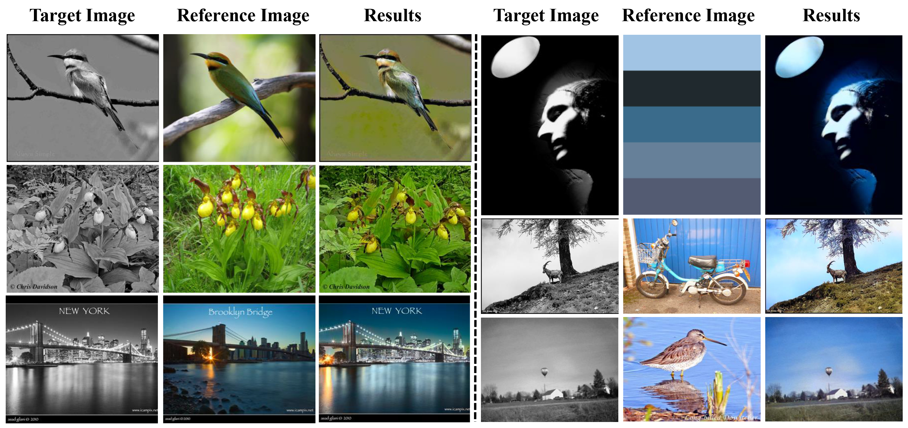

# Transformer for Image Colorization (Pytorch Implementation)



### [Paper](https://dl.acm.org/doi/10.1145/3474085.3475385) | [Pretrained Model](https://drive.google.com/file/d/11FM-2v4iVH8Dvowo-7bQG56Z_ey8kjOa/view?usp=sharing)

**Yes, "Attention Is All You Need", for Exemplar based Colorization, ACMMM2021**

Wang Yin<sup>1</sup>,
Peng Lu<sup>1</sup>,
Zhaoran Zhao<sup>1</sup>,
Xujun Peng<sup>2</sup> <br>
<sup>1</sup>Beijing University of Posts and Telecommunications,<sup>2</sup>USC
## Table of Contents

- [Prerequisites](#Prerequisites)
- [Getting Started](#Getting-Started)
- [Citation](#Citation)

## Prerequisites
- Ubuntu 16.04
- Python 3.6.10
- Pytorch 1.5.1
- CPU or NVIDIA GPU + CUDA 10.2 CuDNN

## Getting Started

### Installation
- Clone this repo:
```bash
git clone https://github.com/wangyins/transformer-for-image-colorization
cd transformer-for-image-colorization
pip install requriments.txt
```
- Download model weights from <a href="https://drive.google.com/file/d/11FM-2v4iVH8Dvowo-7bQG56Z_ey8kjOa/view?usp=sharing">this link</a> to get "checkpoints_acmmm2021.zip"
```bash
mkdir -p checkpoints/imagenet/
cd checkpoints/imagenet/
unzip checkpoints_acmmm2021.zip
```
### Testing
```bash
sh test.sh
```
## Citation
If you use this code for your research, please cite our paper.
```
@inproceedings{yin_mm2021,
  title={Yes, "Attention Is All You Need", for Exemplar based Colorization},
  author={Yin, Wang and Lu, Peng and Zhao, ZhaoRan and Peng, XuJun},
  booktitle={Proceedings of the 29th ACM International Conference on Multimedia},
  year={2021}
}
```
